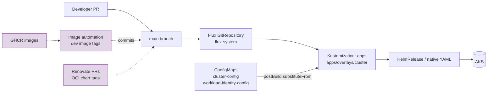
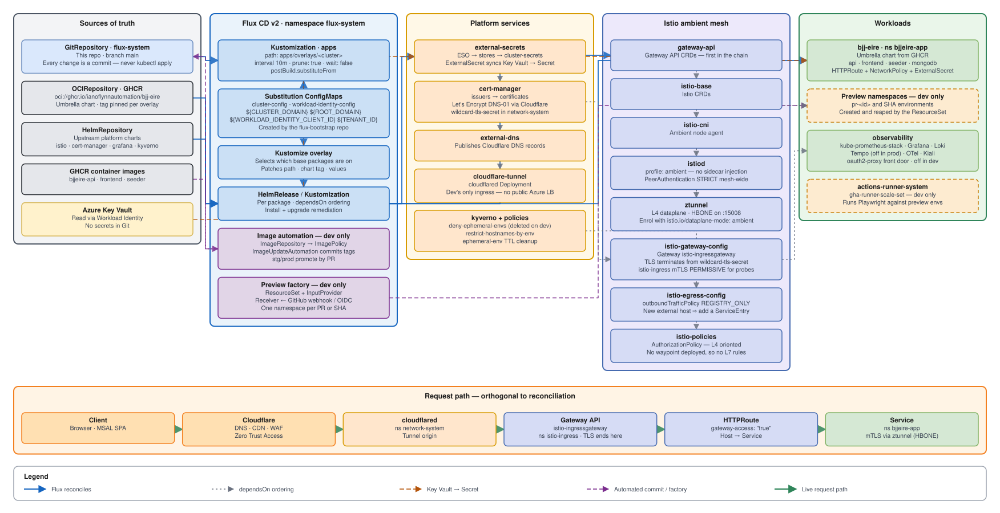
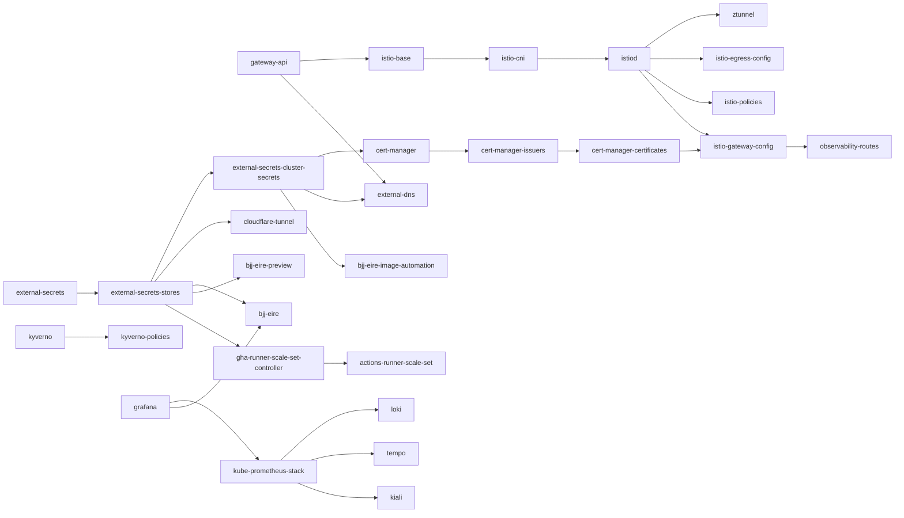
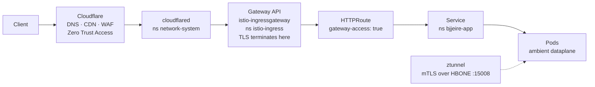

# Architecture

How this GitOps repo maps to AKS, Flux, and the BJJ Éire application.

## Goals

- **Single source of truth** in Git for application and platform config on AKS
- **Continuous reconciliation** via Flux CD v2 (no manual drift-prone applies)
- **Environment isolation** through Kustomize overlays
- **Secure defaults**: ambient mesh, Key Vault secrets, TLS at the edge

## Technology stack

| Layer | Choice |
|-------|--------|
| Cluster | Azure Kubernetes Service (AKS) |
| GitOps | Flux CD v2 (~2.9 in CI) |
| Package delivery | Helm via `HelmRelease` + `OCIRepository` / `HelmRepository` |
| Service mesh | Istio **1.29** ambient (ztunnel + CNI), Gateway API ingress |
| Secrets | External Secrets Operator → Azure Key Vault |
| Certificates | cert-manager, Let’s Encrypt (DNS-01, Cloudflare) |
| DNS / edge | ExternalDNS, Cloudflare (Tunnel used heavily in dev) |
| Identity | Azure Workload Identity |
| Policy | Kyverno |
| Observability | kube-prometheus-stack, Grafana, Loki, Tempo, OTel, Kiali (env-dependent) |
| App chart | Umbrella `bjj-eire` from GHCR OCI |

## Logical flow

Two **independent** release trains converge here:

1. **App container images** (`bjjeire-api`, `bjjeire-frontend`, `bjjeire-seeder`) — Flux Image Automation on **dev** only
2. **Helm chart versions** (umbrella + platform charts) — **Renovate** PRs; pins live in overlays

See [releases.md](releases.md) and [ADR-0006](adr/0006-split-release-trains-images-and-charts.md).

A detailed, editable version of the whole topology — sources, Flux, platform,
mesh, workloads, and the request path — is
[`diagrams/architecture.drawio.svg`](diagrams/architecture.drawio.svg). It
renders inline on GitHub and opens for editing in
[diagrams.net](https://app.diagrams.net/) or the draw.io VS Code extension.

## Base / overlay pattern

- **`kubernetes/apps/base/`** — reusable, environment-agnostic resources. Prefer `${VARIABLE}` substitution over hardcoded cluster values.
- **`kubernetes/apps/overlays/<cluster>/`** — composes selected base packages, patches paths (e.g. `bjj-eire` Flux Kustomization `spec.path`), and sets env-specific values/image tags/chart tags.
- **`kubernetes/clusters/<cluster>/`** — Flux bootstrap entry: top-level `apps` Kustomization pointing at the overlay, with `postBuild.substituteFrom` for cluster ConfigMaps.

### What each overlay typically patches

| Concern | Where |
|---------|--------|
| Which platform components are enabled | Overlay `kustomization.yaml` resource list |
| `bjj-eire` reconcile path | Patch on Flux Kustomization `bjj-eire` → overlay `bjj-eire/` dir |
| Chart version | JSON6902 / strategic patch on `OCIRepository` `bjj-eire` `spec.ref.tag` |
| Image tags | `helmrelease-images.yaml` (Flux markers **only** in dev) |
| App Helm values | `helmrelease-*-values.yaml` |

## Flux resource types (in this repo)

| Kind | Typical file | Purpose |
|------|--------------|---------|
| `Kustomization` | `ks.yaml` | Reconcile a Git path; `dependsOn` orders rollout |
| `HelmRelease` | `helmrelease.yaml` | Install/upgrade Helm charts with remediation |
| `OCIRepository` | `ocirepository.yaml` | Pull chart from OCI (GHCR, gcr.io, …) |
| `HelmRepository` | under `flux-system/repositories` | Classic chart repos where needed |
| `ImageRepository` / `ImagePolicy` / `ImageUpdateAutomation` | `bjj-eire/image-automation/` | Dev image tag automation |
| `ResourceSet` / `ResourceSetInputProvider` | `bjj-eire-preview/controller/` | PR (`deploy-preview`) + SHA Static providers on **dev** only. Full map: [bjj-eire-preview.md](bjj-eire-preview.md) |
| `Receiver` | `bjj-eire-preview/controller/receiver.yaml` | Immediate reconcile of the PR provider (GitHub webhook or GHA OIDC) |
| `ExternalSecret` | various | Sync from Key Vault |

## Dependency chain

Respect order when adding platform pieces. This is the real `dependsOn` graph
as declared in the `ks.yaml` / `k8.yaml` files:

Observability HTTPRoutes and app ingress depend on a healthy gateway and
certificates. Avoid circular `dependsOn`.

Two ordering traps worth knowing:

- **`external-secrets-stores` is the hinge.** cert-manager, cloudflare-tunnel,
  bjj-eire, the preview factory and the ARC controller all wait on it. When the
  Azure identity behind ESO is stale, everything downstream stalls at once —
  see [ADR-0008](adr/0008-secrets-via-external-secrets-and-workload-identity.md).
- **Disabling a component breaks its dependents.** Prod disables Tempo, so its
  overlay also patches `opentelemetry-collector` to drop `tempo` from
  `dependsOn`; without that the collector would wait on a Kustomization that is
  never deployed. See [ADR-0010](adr/0010-observability-is-cost-gated-per-environment.md).

## Service mesh (ambient)

- **Dataplane**: ambient-only in all environments (`profile: ambient` on istiod/cni; ztunnel).
- **Enrollment**: namespace label `istio.io/dataplane-mode: ambient` (e.g. `bjjeire-app`, `observability`).
- **Do not** add `istio-injection: enabled` or `sidecar.istio.io/inject` for workloads.
- **mTLS**: mesh-wide **STRICT** (`istio-system`); **PERMISSIVE** in `istio-ingress` for Azure LB / external probes.
- **Egress**: outbound **REGISTRY_ONLY** — add hosts in `istio-egress/config/service-entries.yaml`.
- **Ingress SA** (for AuthorizationPolicies): `cluster.local/ns/istio-ingress/sa/istio-ingressgateway-istio`.
- **Gateway access** for HTTPS routes: namespace label `gateway-access: "true"`.
- **L7 AuthorizationPolicies** (JWT, path/method) need a waypoint — none is deployed; keep policies L4-oriented unless you add one.
- In-mesh traffic uses **HBONE** (port **15008**) — NetworkPolicies must allow it where relevant.

### Traffic path (typical public/edge)

TLS terminates at the Gateway using the wildcard cert from cert-manager
(`network-system`). On dev the tunnel is the **only** ingress — there is no
public Azure load balancer
([ADR-0009](adr/0009-cloudflare-tunnel-is-dev-ingress.md)).

## Variable substitution

Flux `postBuild.substituteFrom` injects values from ConfigMaps (commonly `cluster-config`, `workload-identity-config`):

| Variable | Use |
|----------|-----|
| `${CLUSTER_DOMAIN}` | Public hostnames |
| `${ROOT_DOMAIN}` | Root / API host variants (e.g. dev API listener) |
| `${WORKLOAD_IDENTITY_CLIENT_ID}` | Azure WI |
| `${TENANT_ID}` | Azure AD tenant |
| `${PRIVATE_EMAIL}` | Let’s Encrypt registration |
| `${OAUTH2_PROXY_CLIENT_ID}` | Entra app for oauth2-proxy |
| `${OAUTH2_PROXY_ALLOWED_GROUP}` | Allowed Entra group Object ID |
| `${CLUSTER_ID}` | Overlay / automation path (image update path) |

Never hardcode cluster-specific IDs in `base/` when a substitute variable exists.

## Managed application stacks

| Stack | Role | Detail |
|-------|------|--------|
| **bjj-eire** | Long-lived API, frontend, seeder, MongoDB, routes, netpols | [bjj-eire.md](bjj-eire.md) |
| **bjj-eire-preview** | Dev-only ResourceSet factory: PR + SHA ephemeral envs | [bjj-eire-preview.md](bjj-eire-preview.md) |
| **Istio** | Ambient mesh, gateway, egress registry, policies | this doc, mesh section |
| **network-system** | cert-manager, ExternalDNS, Cloudflare Tunnel | |
| **external-secrets** | Key Vault sync | |
| **observability** | Metrics, logs, traces, dashboards, auth front door | env-dependent |
| **actions-runner-system** | Self-hosted GHA runners (primarily dev); also hit preview Services in-cluster | |
| **kyverno** | Hostname restrictions, deny-ephemeral-envs (non-dev), TTL cleanup | |
| **flux-system** | Sources and Flux extras (monitors/dashboards where enabled) | |

Env-specific enablement lives in each overlay’s resource list (dev disables most observability for cost; prod may disable Tempo, etc.). Preview factory is referenced **only** from `aks-bjjeire-dev-sdc-01`.

## Why it is built this way

The decisions behind the choices on this page — ambient mesh, `REGISTRY_ONLY`
egress, L4-only policies, split release trains, dev-only previews — are
recorded in [adr/](adr/). Read the relevant one before reversing any of them;
several look like gaps and are deliberate.

| If you are changing… | Read first |
|---|---|
| Mesh mode, sidecar annotations | [ADR-0003](adr/0003-istio-ambient-not-sidecar.md) |
| An `AuthorizationPolicy` | [ADR-0005](adr/0005-no-waypoint-l4-authorization-policies.md) — L7 rules silently do nothing |
| Anything that calls an external host | [ADR-0004](adr/0004-registry-only-egress.md) |
| Image tags or chart pins | [ADR-0006](adr/0006-split-release-trains-images-and-charts.md) |
| Preview environments | [ADR-0007](adr/0007-preview-environments-are-dev-only.md) |
| Secrets | [ADR-0008](adr/0008-secrets-via-external-secrets-and-workload-identity.md) |
| Observability enablement | [ADR-0010](adr/0010-observability-is-cost-gated-per-environment.md) |

## Related docs

- [adr/](adr/) — architecture decision records
- [diagrams/](diagrams/) — editable `architecture.drawio.svg`
- [bjj-eire.md](bjj-eire.md) — long-lived application (paths, Helm values, routes, image automation)
- [bjj-eire-preview.md](bjj-eire-preview.md) — PR/SHA test factory (ResourceSet, Kyverno, ARC plaintext)
- `../.agent/rules/core-gitops.md` — constraints for generating Flux YAML
- [Deploy](deploy.md) — validate and ship changes
- [Releases](releases.md) — charts and images
- [Operations](operations.md) — day-two Flux
