# DevOps flow

End-to-end delivery lifecycle: developer commit → CI → GHCR artifact → Flux
reconciliation → AKS. Where [architecture.md](../architecture.md) describes
*what the platform is made of*, this page describes *how a change reaches a
cluster* and *what stops it on the way*.

Both diagrams are plain Mermaid — they render on GitHub, in the VS Code preview,
and in [mermaid.live](https://mermaid.live). Edit the fenced block directly;
there is no separate source file.

Scope note: the registry is **GHCR**, not ACR, and CI is **GitHub Actions**, not
Azure Pipelines. Environments are **three isolated AKS clusters**, not one
cluster partitioned by namespace, and promotion is an **edit to a tag pin inside
an overlay**, not a move between directories.

---

## Delivery pipeline

```mermaid
graph TD
    %% ============ 1. DEVELOPER ============
    subgraph Developer_Zone["Developer Zone"]
        DEV(["Developer: feature branch commit"])
        PROMO(["Human: promotion PR for stg and prod pins"])
    end

    %% ============ 2. SOURCE REPOSITORIES ============
    subgraph Source_Repos["Source Repositories - github.com/ianoflynnautomation"]
        APPREPO["bjjeire<br/>app code: api, frontend, seeder"]
        CHARTREPO["bjjeire-deploy<br/>umbrella Helm chart bjj-eire"]
        GITOPS["bjjeire-gitops<br/>fleet state repo, branch main"]
        TFREPO["bjjeire-terraform-azurerm-aks<br/>bjjeire-terraform-gitops-flux-bootstrap"]
    end

    %% ============ 3. CI LAYER ============
    subgraph CI_Pipeline["CI Layer - GitHub Actions, reusable workflows from bjjeire-ci-templates"]
        CIAPP["App CI: build, test, semver release tag,<br/>container build and push"]
        CICHART["Chart CI: helm lint and package,<br/>release-please version bump"]
        CIGITOPS["GitOps CI: manifest-validation kustomize plus kubeconform,<br/>flux-local diff across all 3 clusters,<br/>sync-audit vs GHCR, yaml-lint, security-policy"]
        GATE{"CODEOWNERS review gate<br/>required for stg and prod"}
    end

    %% ============ 4. ARTIFACT REGISTRY ============
    subgraph GHCR["GHCR - GitHub Container Registry, immutable tags"]
        IMG[("Container images<br/>bjjeire-api, bjjeire-frontend, bjjeire-seeder<br/>tag pattern vX.Y.Z")]
        CHART[("OCI Helm chart<br/>oci://ghcr.io/ianoflynnautomation/bjj-eire<br/>tag pinned per overlay")]
    end

    %% ============ 5. GITOPS STATE REPO ============
    subgraph GitOps_Repo["Fleet State Repo - kubernetes/ tree on branch main"]
        BASE["apps/base<br/>env-agnostic ks.yaml, helmrelease.yaml, ocirepository.yaml"]
        CLDEV["clusters/aks-bjjeire-dev-sdc-01/ks.yaml"]
        CLSTG["clusters/aks-bjjeire-stg-sdc-01/ks.yaml"]
        CLPRD["clusters/aks-bjjeire-prod-sdc-01/ks.yaml"]
        OVDEV["overlays/aks-bjjeire-dev-sdc-01<br/>helmrelease-images.yaml with imagepolicy setters"]
        OVSTG["overlays/aks-bjjeire-stg-sdc-01<br/>helmrelease-images.yaml, manual pins"]
        OVPRD["overlays/aks-bjjeire-prod-sdc-01<br/>helmrelease-images.yaml, manual pins"]
        BASE --> OVDEV
        BASE --> OVSTG
        BASE --> OVPRD
        CLDEV --> OVDEV
        CLSTG --> OVSTG
        CLPRD --> OVPRD
    end

    %% ============ 6. BOT-DRIVEN UPDATE TRAIN ============
    RENOVATE["Renovate bot<br/>chart tag and GitHub Action PRs"]

    %% ============ 7. DEV CLUSTER ============
    subgraph AKS_Dev["AKS Cluster - aks-bjjeire-dev-sdc-01"]
        subgraph FluxDev["flux-system - Flux CD v2 plus Flux Operator"]
            SRCD["source-controller"]
            KUSD["kustomize-controller"]
            HELD["helm-controller"]
            IRCD["image-reflector and<br/>image-automation controllers"]
            NOTD["notification-controller<br/>Receiver bjj-eire-prs"]
            RSTD["resourceset-controller<br/>preview factory"]
        end
        PLATD["Platform: istio ambient, gateway-api, external-secrets,<br/>cert-manager, external-dns, cloudflare-tunnel, kyverno, ARC runners"]
        APPD["namespace bjjeire-app<br/>HelmRelease bjj-eire: api, frontend, seeder, mongodb"]
        PREVD["Ephemeral namespaces pr-id and sha-id<br/>TTL 2h and 4h, dev only"]
    end

    %% ============ 8. STAGING CLUSTER ============
    subgraph AKS_Staging["AKS Cluster - aks-bjjeire-stg-sdc-01"]
        subgraph FluxStg["flux-system - Flux CD v2"]
            SRCS["source-controller"]
            KUSS["kustomize-controller"]
            HELS["helm-controller"]
        end
        PLATS["Platform plus full observability:<br/>prometheus, grafana, loki, tempo, otel, kiali"]
        APPS["namespace bjjeire-app<br/>HelmRelease bjj-eire, manually pinned tags"]
    end

    %% ============ 9. PRODUCTION CLUSTER ============
    subgraph AKS_Prod["AKS Cluster - aks-bjjeire-prod-sdc-01"]
        subgraph FluxPrd["flux-system - Flux CD v2"]
            SRCP["source-controller"]
            KUSP["kustomize-controller"]
            HELP["helm-controller"]
        end
        PLATP["Platform, cost gated:<br/>tempo and kiali disabled by overlay patch"]
        APPP["namespace bjjeire-app<br/>HelmRelease bjj-eire, manually pinned tags"]
    end

    %% ============ 10. AZURE PLATFORM ============
    subgraph Azure["Azure Platform - owned by Terraform, never by GitOps"]
        KV[("Azure Key Vault<br/>secrets via Workload Identity")]
        CFG["ConfigMaps cluster-config and workload-identity-config<br/>consumed by postBuild substituteFrom"]
    end

    %% ---- Terraform boundary ----
    TFREPO -.->|"0a. provision AKS, identity, Key Vault, Flux bootstrap"| Azure
    TFREPO -.->|"0b. seed cluster ConfigMaps"| CFG

    %% ---- Developer to CI to registry ----
    DEV -->|"1a. git push app code"| APPREPO
    DEV -->|"1b. git push chart change"| CHARTREPO
    APPREPO -->|"2a. release tag triggers workflow"| CIAPP
    CHARTREPO -->|"2b. release tag triggers workflow"| CICHART
    CIAPP -->|"3a. push immutable image vX.Y.Z"| IMG
    CICHART -->|"3b. push OCI chart artifact"| CHART

    %% ---- Train A: dev image automation, no human ----
    IMG -.->|"4. ImageRepository scan every 5m"| IRCD
    IRCD -.->|"5a. ImagePolicy semver pick, Setters strategy"| OVDEV
    IRCD -.->|"5b. commit chore flux update image tags to main"| GITOPS

    %% ---- Train B: charts and promotion, human gated ----
    CHART -.->|"6. detect newer chart tag"| RENOVATE
    RENOVATE -->|"7a. open PR against main"| GITOPS
    PROMO -->|"7b. copy verified dev tags into stg or prod overlay"| GITOPS
    GITOPS -->|"8. PR triggers validation"| CIGITOPS
    CIGITOPS -->|"9. checks pass"| GATE
    GATE -->|"10. approve and merge to main"| GITOPS

    %% ---- Flux entrypoints ----
    GITOPS -->|"11a. Flux bootstrap path"| CLDEV
    GITOPS -->|"11b. Flux bootstrap path"| CLSTG
    GITOPS -->|"11c. Flux bootstrap path"| CLPRD

    %% ---- Pull and reconcile loop, one per cluster ----
    CLDEV ==>|"12a. GitRepository pull, auto sync on commit"| SRCD
    CLSTG ==>|"12b. GitRepository pull, post merge only"| SRCS
    CLPRD ==>|"12c. GitRepository pull, post merge only"| SRCP

    SRCD -->|"13a. artifact to Kustomization apps, interval 10m"| KUSD
    SRCS -->|"13b. artifact to Kustomization apps, interval 10m"| KUSS
    SRCP -->|"13c. artifact to Kustomization apps, interval 10m"| KUSP

    CFG -.->|"14. substituteFrom variable injection"| KUSD
    CFG -.->|"14. substituteFrom variable injection"| KUSS
    CFG -.->|"14. substituteFrom variable injection"| KUSP

    KUSD -->|"15a. apply with dependsOn ordering, prune true"| PLATD
    KUSS -->|"15b. apply with dependsOn ordering, prune true"| PLATS
    KUSP -->|"15c. apply with dependsOn ordering, prune true"| PLATP

    KUSD -->|"16a. reconcile HelmRelease"| HELD
    KUSS -->|"16b. reconcile HelmRelease"| HELS
    KUSP -->|"16c. reconcile HelmRelease"| HELP

    CHART -.->|"17a. OCIRepository pull, interval 5m"| HELD
    CHART -.->|"17b. OCIRepository pull, interval 5m"| HELS
    CHART -.->|"17c. OCIRepository pull, interval 5m"| HELP

    HELD -->|"18a. helm upgrade and install"| APPD
    HELS -->|"18b. helm upgrade and install"| APPS
    HELP -->|"18c. helm upgrade and install"| APPP

    IMG -.->|"19. kubelet pull via ghcr-pull-secret"| APPD
    IMG -.->|"19. kubelet pull via ghcr-pull-secret"| APPS
    IMG -.->|"19. kubelet pull via ghcr-pull-secret"| APPP

    KV -.->|"20. ExternalSecret sync, refresh 1h"| PLATD
    KV -.->|"20. ExternalSecret sync, refresh 1h"| PLATS
    KV -.->|"20. ExternalSecret sync, refresh 1h"| PLATP

    %% ---- Preview factory, dev only ----
    APPREPO -.->|"21. PR labelled deploy-preview, webhook or GHA OIDC"| NOTD
    NOTD -.->|"22. reconcile ResourceSetInputProvider"| RSTD
    RSTD -.->|"23. render namespace plus HelmRelease per PR, limit 3"| PREVD

    %% ---- Styling ----
    classDef auto fill:#E1D5E7,stroke:#7B2D8E,color:#000
    classDef gate fill:#FFE6CC,stroke:#D79B00,color:#000
    classDef registry fill:#D5E8D4,stroke:#82B366,color:#000
    classDef flux fill:#DAE8FC,stroke:#6C8EBF,color:#000
    classDef infra fill:#F5F5F5,stroke:#666666,color:#000

    class IRCD,RENOVATE,RSTD,NOTD auto
    class GATE,PROMO gate
    class IMG,CHART,KV registry
    class SRCD,KUSD,HELD,SRCS,KUSS,HELS,SRCP,KUSP,HELP flux
    class TFREPO,CFG infra
```

### Edge conventions

| Edge | Meaning |
|---|---|
| Solid arrow | A human or a pipeline step causes this |
| Thick arrow `==>` | Flux pull / reconcile loop entry per cluster |
| Dotted arrow | Polled, event-driven, or automated — no human in the loop |
| Diamond node | Approval gate |
| Cylinder node | Registry or secret store |

---

## Execution narrative

### Step 0 — Infrastructure, outside GitOps

`bjjeire-terraform-azurerm-aks` provisions the three AKS clusters, the
user-assigned identity, Workload Identity / OIDC, and Key Vault.
`bjjeire-terraform-gitops-flux-bootstrap` bootstraps Flux and seeds the
`cluster-config` and `workload-identity-config` ConfigMaps.

GitOps never creates Azure resources. A `${VARIABLE}` that resolves to an empty
string is a bootstrap gap in that repo, not a missing default here — see
[AGENTS.md](../../AGENTS.md).

### Steps 1–3 — Trigger, CI, artifact

| Train | Repo | Trigger | Artifact |
|---|---|---|---|
| Images | `bjjeire` | semver release tag | `ghcr.io/…/bjjeire-api`, `-frontend`, `-seeder` at `vX.Y.Z` |
| Chart | `bjjeire-deploy` | release-please tag | `oci://ghcr.io/…/bjj-eire` |

The two trains are independent: an image bump never requires a chart bump, and
the reverse holds too
([ADR-0006](../adr/0006-split-release-trains-images-and-charts.md)).

### Steps 4–5 — Train A: dev image automation, no human

`ImageRepository` scans GHCR every **5m** using `ghcr-pull-secret`. `ImagePolicy`
selects by semver range — `>=0.1.0 <1.0.0` for api and seeder, `>=0.1.30 <1.0.0`
for frontend. `ImageUpdateAutomation` runs every **30m**, rewrites the
`$imagepolicy` setter comments, and commits straight to `main` as `Flux Bot` at
`./kubernetes/apps/overlays/${CLUSTER_ID}/bjj-eire`.

Automation is enabled from the **dev overlay only** —
`kubernetes/apps/overlays/aks-bjjeire-dev-sdc-01/kustomization.yaml` holds the
single reference to `image-automation/ks.yaml`. That enablement, not the
presence or absence of setter comments, is what keeps stg and prod manual.

### Steps 6–10 — Train B: charts and promotion, human gated

Renovate raises PRs for chart tags and Action pins. It is deliberately kept away
from `helmrelease-images.yaml` and `image-automation/**`, which Flux owns
([releases.md](../releases.md)).

Promotion to stg or prod is a hand-written PR copying a dev-verified tag into the
target overlay. Everything merging to `main` passes:

| Workflow | What it proves |
|---|---|
| `manifest-validation.yaml` | kustomize build + kubeconform for every overlay; fails on any mutable `oci://…:latest` reference |
| `flux-local.yaml` | Flux/Helm dry-run diff rendered against all three cluster paths, posted to the PR |
| `sync-audit.yml` | Every pinned chart and image tag actually exists in GHCR — daily cron plus any overlay PR |
| `yaml-lint.yaml`, `security-policy.yaml` | Lint and policy |

The stg/prod gate itself is **CODEOWNERS review** (`@ianoflynn` on
`kubernetes/`), not a distinct required check.

### Steps 11–14 — Reconciliation

Each `clusters/<name>/ks.yaml` declares one entry `Kustomization` named `apps` in
`flux-system`: `interval: 10m`, `timeout: 30m`, `prune: true`, `wait: false`,
`sourceRef` → `GitRepository/flux-system`, `path` → that cluster's overlay.

`source-controller` pulls the Git artifact. `kustomize-controller` builds the
overlay and injects `${CLUSTER_DOMAIN}`, `${ROOT_DOMAIN}`,
`${WORKLOAD_IDENTITY_CLIENT_ID}`, `${TENANT_ID}` and `${CLUSTER_ID}` through
`postBuild.substituteFrom`.

Environments differ by **what the overlay lists**, not by branch:

| | dev | stg | prod |
|---|---|---|---|
| Image tags | Flux automation | promotion PR | promotion PR |
| Observability | mostly disabled for cost | full stack | Tempo and Kiali disabled |
| Previews | enabled | denied by Kyverno | denied by Kyverno |
| ARC runners | enabled | off | off |
| Ingress | Cloudflare Tunnel only | gateway | gateway |

### Steps 15–20 — Deployment

`dependsOn` fixes rollout order —
`gateway-api → istio-base → istio-cni → istiod → {ztunnel, egress, policies, gateway-config}`
and `external-secrets → external-secrets-stores → …`. `external-secrets-stores`
is the shared hinge: cert-manager, cloudflare-tunnel, `bjj-eire`, the preview
factory and the ARC controller all wait on it, so a stale Azure identity stalls
all of them at once
([ADR-0008](../adr/0008-secrets-via-external-secrets-and-workload-identity.md)).

`helm-controller` reconciles `HelmRelease/bjj-eire` in `bjjeire-app` against
`OCIRepository/bjj-eire` (interval 5m, tag pinned independently per overlay).
Kubelet pulls images with `ghcr-pull-secret`; ESO syncs Key Vault secrets on a
1h refresh.

`prune: true` means **commenting a line out of an overlay deletes the resource
from the cluster.**

### Rollback

`git revert` on `main` and let Flux reconcile. Break-glass is
`flux suspend hr bjj-eire -n bjjeire-app` → fix the pin in Git → `flux resume`.
Full sequence in [operations.md](../operations.md).

---

## Ephemeral environment factory — dev cluster only

```mermaid
graph LR
    subgraph GH["GitHub - ianoflynnautomation/bjjeire"]
        PR(["PR labelled deploy-preview"])
        MAIN(["Merge to main or SHA build"])
        GHA["GitHub Actions job"]
    end

    subgraph FluxSys["AKS dev - namespace flux-system"]
        RCV["Receiver bjj-eire-prs<br/>type github, HMAC secret"]
        RCVO["Receiver bjj-eire-preview-oidc<br/>generic-oidc, repo claim validated"]
        RSIP["ResourceSetInputProvider bjj-eire-prs<br/>GitHubPullRequest, filter.limit 3<br/>reconcileEvery 1m fallback"]
        STAT["Static ResourceSetInputProvider<br/>label bjjeire.io/sha-env=true<br/>applied by CI, not in Git"]
        RS["ResourceSet bjj-eire-previews<br/>steps: namespace then release"]
    end

    subgraph EnvNs["Generated namespace pr-id or sha-id"]
        NS["Namespace plus ResourceQuota plus LimitRange<br/>labels: ambient dataplane, gateway-access true"]
        ES["ExternalSecret from Azure Key Vault"]
        HR["HelmRelease bjj-eire<br/>values from copied ConfigMap"]
        PODS["API plus frontend plus mongodb pods"]
    end

    subgraph Guards["Policy and cleanup"]
        KYVD["Kyverno deny-ephemeral-envs<br/>active on stg and prod, deleted in dev overlay"]
        KYVC["Kyverno cleanup policies<br/>janitor/ttl 2h PR, 4h SHA"]
    end

    OCI[("OCIRepository bjj-eire<br/>in namespace bjjeire-app")]

    PR -->|"1a. webhook event pull_request"| RCV
    MAIN -->|"1b. workflow run"| GHA
    GHA -->|"2a. OIDC token to notification-controller"| RCVO
    GHA -->|"2b. kubectl apply Static provider"| STAT
    RCV -->|"3a. trigger reconcile"| RSIP
    RCVO -->|"3b. trigger reconcile"| RSIP
    RSIP -->|"4a. PR inputs: id, sha, branch"| RS
    STAT -->|"4b. inputs: ns, imageTag, ttl"| RS
    RS -->|"5. step namespace"| NS
    RS -->|"6. step release"| HR
    NS --> ES
    ES -->|"7. mongodb and entra secrets"| HR
    OCI -.->|"8. same umbrella chart, ephemeral values"| HR
    HR -->|"9. helm install"| PODS
    KYVC -.->|"10. TTL reap, provider deleted"| STAT
    KYVC -.->|"10. TTL reap, namespace deleted"| NS
    RS -.->|"11. input disappears, ResourceSet prunes"| EnvNs
    KYVD -.->|"blocks this whole flow outside dev"| RS

    classDef trig fill:#E1D5E7,stroke:#7B2D8E,color:#000
    classDef guard fill:#F8CECC,stroke:#B85450,color:#000
    classDef store fill:#D5E8D4,stroke:#82B366,color:#000
    class PR,MAIN,GHA trig
    class KYVD,KYVC guard
    class OCI store
```

Note the direction of enforcement: `deny-ephemeral-envs` ships in `base/kyverno`
and is **active everywhere except dev**, where the dev overlay explicitly
`$patch: delete`s it. Seeding a new cluster by copying the dev overlay would
silently enable previews there
([ADR-0007](../adr/0007-preview-environments-are-dev-only.md)).

Object-level detail — ResourceSet steps, input schema, RBAC, the parallel
`sha-env/manifests.yaml` kubectl template and its ConfigMap trap — is in
[bjj-eire-preview.md](../bjj-eire-preview.md).

---

## Keeping this accurate

Update this page in the same PR when you change: CI workflow topology, which
environments run image automation, the promotion gate, registry or chart
coordinates, or the preview trigger path. Structural platform changes belong in
[architecture.drawio.svg](architecture.drawio.svg) instead — see
[README.md](README.md) for which file to reach for.
